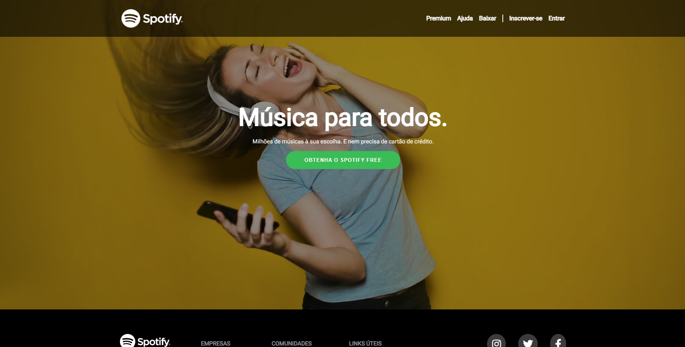

# AAAAAAAAAAAAAAAAAAAAAAAAAAAAAAAAAAAAAA

AAAAAAAAAAAAA

## Table of contents

- [Overview](#overview)
  - [The challenge](#the-challenge)
  - [Screenshot](#screenshot)
  - [Links](#links)
- [My process](#my-process)
  - [Built with](#built-with)

## Overview

### The challenge

Users should be able to:

- AAAAAAAAAAAAAAAAAze
- AAAAAAAAAAAAAAA

### Screenshot

  - Desktop
  
    
    
  - Mobile
  
    

### Links

- Live Site URL: https://spotify-clone-rafael.netlify.app

## My process

### Built with

- Semantic HTML5 markup
- CSS custom properties
- Flexbox
- CSS Grid
